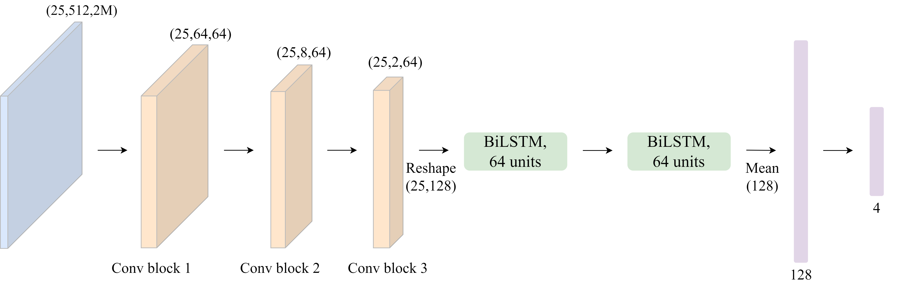

# Sound Source Localization in the ADOS-2 Observation Room
Deep Learning for Sparse, Non-Uniform Microphone Arrays

Presented at IEEE EMBC 2025

# Overview

This repository contains the full implementation of the EMBC 2025 paper:

“Sound Source Localization for Autistic Children’s Session Recordings”
Naomi Mayrose, Marina Eni, Igal Bilik, Yaniv Zigel

The project proposes a deep learning–based framework for sound source localization (SSL) in the ADOS-2 autism diagnostic room.
Due to the sparse and irregular microphone geometry, conventional beamforming is not applicable.
We therefore formulate SSL as a 4-class classification problem, predicting one of the following zones:

* Desk

* Carpet

* Sofa

* Other

The repository includes simulation, preprocessing, data loading, model training, and evaluation tools.

# Pipeline Overview

Room Simulation -> STFT Segmentation -> Dataset -> Training -> Evaluation

To run the full pipeline:
```
python run_experiment.py -c configs/Param_ACS.yaml
```

# Model Architectures
## BiLSTM-Based Architecture
<figure>

</figure>

## Hybrid Transformer + BiLSTM Architecture
<figure>

</figure>


# Data Availability

Important:
This repository does not include the full dataset used in the EMBC 2025 experiments.

To recreate the full dataset, use:

ados_room_simulation.py

save_segments.py

LibriSpeech clean speech

A noise dataset (e.g., MS-SNSD)

# Main Results (EMBC 2025)
## Clean Speech (8 microphones)

| Model  | Accuracy |
| ------ | -------- |
| BiLSTM | 89.86%   |
| Hybrid | 89.97%   |


## Additive Noise (SNR 5–15 dB)

| Model  | Accuracy |
| ------ | -------- |
| BiLSTM | 87.59%   |
| Hybrid | 87.42%   |

## Reverberation (RT60 = 0.5–0.9 s)

Both models maintain accuracy above 85% across conditions.

# Acknowledgements

This project uses external datasets and tools:

LibriSpeech: https://www.openslr.org/12

MS-SNSD(noise dataset): https://github.com/microsoft/MS-SNSD

Pyroomacoustics for room simulation: https://github.com/LCAV/pyroomacoustics

We also thank the Azrieli National Centre for Autism and Neurodevelopment Research for providing room configuration details.
